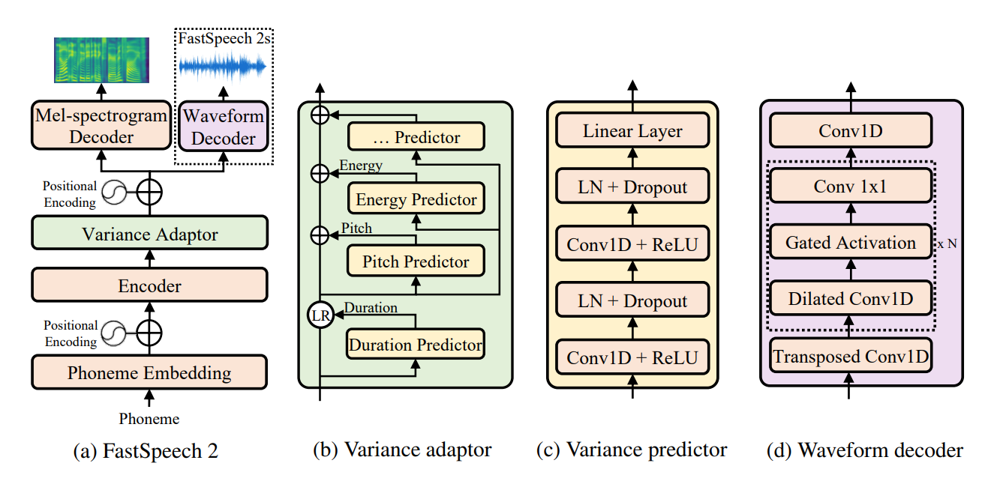

# Fastspeech 2 (Experimental)
UnOfficial PyTorch implementation of [**FastSpeech 2: Fast and High-Quality End-to-End Text to Speech**](https://arxiv.org/abs/2006.04558). This repo uses the FastSpeech implementation of  [Espnet](https://github.com/espnet/espnet) as a base. In this implementation I tried to replicate the exact paper details but still some modification required for better model, this repo open for any suggettion and improvement. This repo uses Nvidia's tacotron 2 preprocessing for audio pre-processing and [MelGAN](https://github.com/seungwonpark/melgan) as vocoder.




## Demo :  [](https://colab.research.google.com/github/rishikksh20/FastSpeech2/blob/master/demo_fastspeech2.ipynb) <br />

## Requirements :
All code written in `Python 3.6.2` .
* Install Pytorch
> Before installing pytorch please check your Cuda version by running following command : 
`nvcc --version`
```buildoutcfg
pip install torch===1.6.0 torchvision===0.7.0 -f https://download.pytorch.org/whl/torch_stable.html
```
In this repo I use Pytorch 1.6.0 for using `torch.bucketize` feature which is not present in previous PyTorch's versions.


* Installing other requirements :
```buildoutcfg
pip install -r requirements.txt
```

* To use Tensorboard install `tensorboard version 1.14.0` seperatly with supported `tensorflow (1.14.0)`


## For Preprocessing :

`filelists` folder contains MFA (Motreal Force aligner) processed LJSpeech dataset files so you don't need to align text with audio (for extract duration) for LJSpeech dataset.
For other dataset follow instruction [here](https://github.com/ivanvovk/DurIAN#6-how-to-align-your-own-data). For other pre-processing run following command :
```
python .\nvidia_preprocessing.py -d path_of_wavs
```
For finding the min and max of F0 and Energy
```buildoutcfg
python .\compute_statistics.py
```
Update the following in `hparams.py` by min and max of F0 and Energy
```
p_min = Min F0/pitch
p_max = Max F0
e_min = Min energy
e_max = Max energy
```

## For training
```buildoutcfg
python3 train_fastspeech.py --outdir results
```

## For inference [WIP]
 [](https://colab.research.google.com/github/rishikksh20/FastSpeech2/blob/master/demo_fastspeech2.ipynb) <br />
Currently only phonemes based Synthesis supported.
```buildoutcfg
python3 synthesis.py --out results --text "DH AH0 N AA1 L AH0 JH AH1 V HH IH1 Z D IH0 F EH1 K SH AH0 N pau pau HH IH1 Z EH1 R AH0 G AH0 N S AH0 N D HH EH0 S T IH1 L AH0 T IY0 T IH0 DH IY0 Y UW0 N AY1 T IH0 D S T EY1 T S pau" --path checkpoints\checkpoint_355k_steps.pyt
```

## Checkpoint and samples:
* Checkpoint find [here](https://drive.google.com/drive/folders/1Fh7zr8zoTydNpD6hTNBPKUGN_s93Bqrs?usp=sharing)
* For samples check `sample` folder.

## Tensorboard

**Training :** <br >
 <br>
**Validation :** <br >

## Note
* Coding of this repo is roughly done just to re-produce the paper and experimentation purpose. Needed a code cleanup and opyimization for better use.
* Currently this repo produces good quality audio but still it is in WIP, many improvement needed.
* Loss curve for F0 is quite high.
* I am using raw F0 and energy for train a model, but we can also use normalize F0 and energy for stable training.
* Using `Postnet` for better audio quality.

## References
- [FastSpeech 2: Fast and High-Quality End-to-End Text to Speech](https://arxiv.org/abs/2006.04558)
- [FastSpeech: Fast, Robust and Controllable Text to Speech](https://arxiv.org/abs/1905.09263)
- [ESPnet](https://github.com/espnet/espnet)
- [NVIDIA's WaveGlow implementation](https://github.com/NVIDIA/waveglow)
- [MelGAN](https://github.com/seungwonpark/melgan)
- [DurIAN](https://github.com/ivanvovk/DurIAN)
- [FastSpeech2 Tensorflow Implementation](https://github.com/TensorSpeech/TensorflowTTS)
- [Other PyTorch FastSpeech 2 Implementation](https://github.com/ming024/FastSpeech2)
- [WaveRNN](https://github.com/fatchord/WaveRNN)
